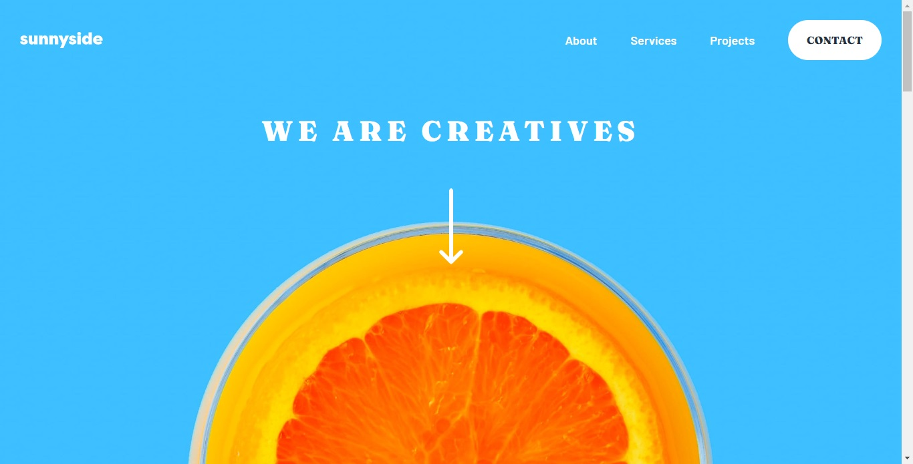

# Sunnyside Agency landing Page Main

<h3 align="justify">
    Esse projeto é um desafio do site <a href="https://www.frontendmentor.io/">Frontend Mentor</a>. Esse programa (Sunnyside Agency Landing Page Main) foi desenvolvido com o objetivo de praticar e consolidar conhecimentos.
</h3>
 

 
    

## Tópicos
- [Imagem do projeto](#img)
- [Acesso ao projeto](#acesso)
- [Descrição do projeto](#desc)
- [Tecnologias utilizadas](#tec)
- [Status do projeto](#status)
- [Desenvolvedores do projeto](#devs)
- [Licença](#license)

 

<h2 id="img">📺 Imagem do projeto</h2>

    

 

<h2 id="acesso">🔗 Acesso ao projeto</h2>

Clique [aqui](https://matheus-bertolini.github.io/SunnySide-Agency-Landing-Page/) para acessar o projeto.

 

<h2 id="desc">📙 Descrição do projeto</h2>

    A Sunnyside é uma agência criativa especializada em ajudar marcas a ter um crescimento mais rápido e efetivo. A Sunny trabalha usando uma fórmula colaborativa de designers, pesquisadores, fotógrafos, cinegrafistas e redatores.

 

<h2 id="tec">🚀 Tecnologias Utilizadas</h2>

* HTML e CSS
* Javascript
* Git e Github

 

<h2 id="status">🚧 Status do projeto</h2>

✔️ Projeto Finalizado :)

 

<h2 id="devs">👨‍💻 Desenvolvedores do projeto</h2>

* Matheus Nunes Bertolini
* Rafael Roberto de Oliveira

 

<h2 id="license">📝 Licença</h2>
Esse projeto está sob a licença MIT.